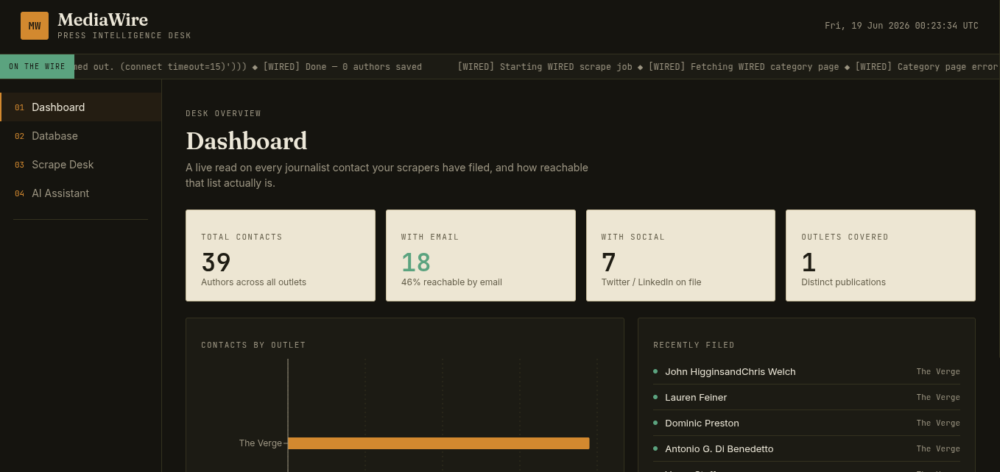
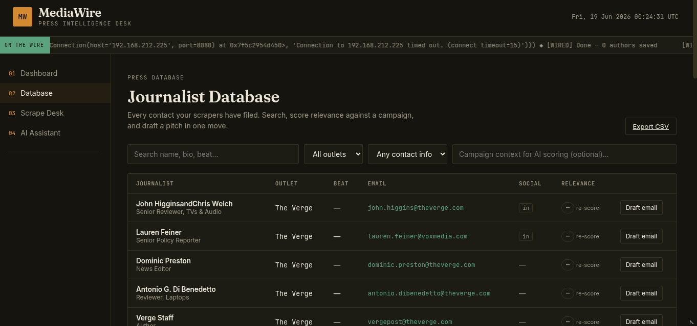
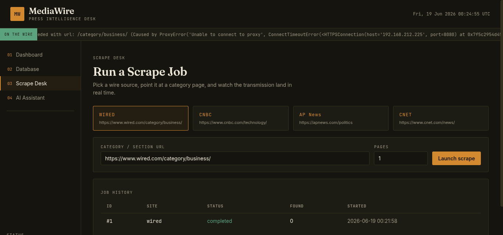
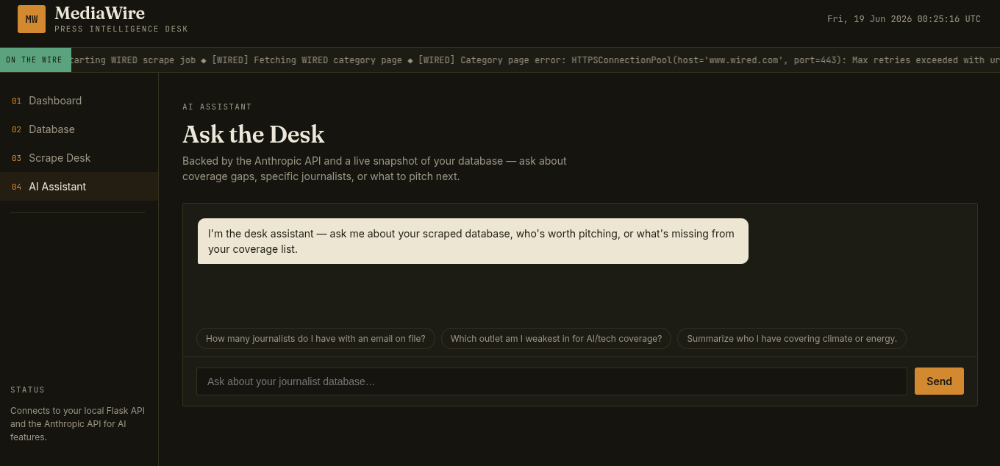

# MediaWire — Press Intelligence Desk

> A full-stack journalist database and AI-powered outreach platform. Scrape bylines from major outlets, score author relevance with Claude, draft personalized pitch emails, and query your contact list through a conversational AI assistant — all from a single dark-themed dashboard.

---

## Tech Stack

**Frontend**


**Backend**


**AI**


---

## Screenshots

### Dashboard

*Live desk overview — total contacts, email reachability rate, outlet breakdown chart, and a real-time "recently filed" ticker.*

### Journalist Database

*Full contact table with search, outlet filter, email filter, AI relevance scoring, and one-click email drafting per journalist.*

### Scrape Desk

*Pick a wire source (WIRED, CNBC, AP News, CNET), point it at a section URL, set page depth, and watch a live terminal log as contacts land in the database.*

### AI Assistant

*Conversational Claude-backed assistant with a live DB snapshot — ask about coverage gaps, specific journalists, or what to pitch next.*

---

## Features

- **Multi-outlet scraping** — modular scrapers for WIRED, CNBC, AP News, and CNET with configurable page depth and threaded fetching
- **Live job terminal** — real-time log stream while a scrape job is running; full job history with status and found-count
- **Journalist database** — searchable, filterable table of every scraped author with name, outlet, title, beat, email, Twitter, LinkedIn, and bio
- **AI relevance scoring** — Claude scores each journalist 1–5 against your campaign context and tags their beat automatically; supports bulk scoring
- **AI email drafting** — one-click personalized pitch email generation per journalist, saved to a per-author draft history
- **AI chat assistant** — conversational interface backed by a live DB snapshot; ask natural-language questions about your contact list
- **CSV export** — download your full author list with active search/filter applied
- **Import from CSV** — ingest `enhanced_authors_*.csv` files produced by external desktop scrapers
- **SQLite persistence** — single-file database with WAL mode; no external DB server required

---

## Project Structure

```
mediawire/
├── backend/
│   ├── app.py                  # Flask REST API (all routes)
│   ├── db.py                   # SQLite persistence layer (no ORM)
│   ├── requirements.txt
│   ├── .env.example
│   ├── scrapers/
│   │   ├── __init__.py         # SITES registry
│   │   ├── base.py             # BaseScraper ABC
│   │   ├── apnews.py
│   │   ├── cnbc.py
│   │   ├── cnet.py
│   │   └── wired.py
│   ├── services/
│   │   ├── ai_service.py       # All Anthropic API calls
│   │   └── job_manager.py      # Threaded scrape job runner
│   └── data/
│       └── mediawire.db        # SQLite database (auto-created)
└── frontend/
    ├── index.html
    ├── vite.config.js
    ├── package.json
    └── src/
        ├── App.jsx
        ├── api.js              # Typed API client
        ├── components/
        │   ├── Layout.jsx / .css
        │   ├── DraftModal.jsx / .css
        │   ├── PageHeader.jsx / .css
        │   ├── ScoreBadge.jsx / .css
        │   └── StatCard.jsx / .css
        └── pages/
            ├── Dashboard.jsx / .css
            ├── Database.jsx / .css
            ├── ScrapeDesk.jsx / .css
            └── Assistant.jsx / .css
```

---

## Getting Started

### Prerequisites

- Python 3.11+
- Node.js 18+
- An [Anthropic API key](https://console.anthropic.com/) (required for AI features)

### 1 — Backend

```bash
cd backend

# Install dependencies
pip install -r requirements.txt

# Configure environment
cp .env.example .env
# → Open .env and add your ANTHROPIC_API_KEY

# Start the API server (http://localhost:5050)
python app.py
```

### 2 — Frontend

```bash
cd frontend

# Install dependencies
npm install

# Configure environment
cp .env.example .env
# → Set VITE_API_URL=http://localhost:5050 if needed

# Start the dev server (http://localhost:5173)
npm run dev
```

Open [http://localhost:5173](http://localhost:5173) in your browser.

---

## API Reference

| Method | Endpoint | Description |
|--------|----------|-------------|
| `GET` | `/api/health` | Health check + AI config status |
| `GET` | `/api/stats` | Dashboard stats snapshot |
| `GET` | `/api/sites` | List available scraper sources |
| `POST` | `/api/scrape` | Launch a scrape job |
| `GET` | `/api/jobs` | List recent jobs |
| `GET` | `/api/jobs/:id` | Job detail + log |
| `GET` | `/api/authors` | List/search/filter authors |
| `GET` | `/api/authors/:id` | Author detail + draft history |
| `GET` | `/api/authors/export` | Download authors as CSV |
| `POST` | `/api/import-existing` | Import from CSV files on disk |
| `POST` | `/api/ai/score` | Score one author with Claude |
| `POST` | `/api/ai/score-bulk` | Score multiple authors |
| `POST` | `/api/ai/draft-email` | Generate pitch email with Claude |
| `POST` | `/api/ai/chat` | Chat with the desk assistant |

---

## Database Schema

```sql
authors       — journalist contacts (name, outlet, title, email, twitter, linkedin,
                bio, beat, relevance_score, ai_summary, …)

jobs          — scrape job records (site, url, status, progress, found_count, log)

email_drafts  — AI-generated pitch emails per author

chat_messages — conversation history for the AI assistant sessions
```

---

## Environment Variables

**Backend (`backend/.env`)**

| Variable | Required | Default | Description |
|----------|----------|---------|-------------|
| `ANTHROPIC_API_KEY` | ✅ Yes | — | Your Anthropic API key |
| `ANTHROPIC_MODEL` | No | `claude-sonnet-4-6` | Claude model to use |
| `PORT` | No | `5050` | Flask server port |

**Frontend (`frontend/.env`)**

| Variable | Required | Default | Description |
|----------|----------|---------|-------------|
| `VITE_API_URL` | No | `http://localhost:5050` | Backend base URL |

---

## Adding a New Scraper

1. Create `backend/scrapers/yoursite.py` extending `BaseScraper`
2. Implement `scrape_category(url)` → list of author dicts
3. Register it in `backend/scrapers/__init__.py`:

```python
from . import yoursite

SITES = {
    ...
    "yoursite": {
        "label": "Your Site",
        "module": yoursite,
        "default_url": "https://yoursite.com/news/"
    },
}
```

The scraper will appear automatically in the Scrape Desk UI.

---

## Building for Production

```bash
# Build the frontend
cd frontend && npm run build

# Serve the dist/ folder from Flask or any static host
# The Flask backend can serve static files directly if needed
```

---

## License

MIT
